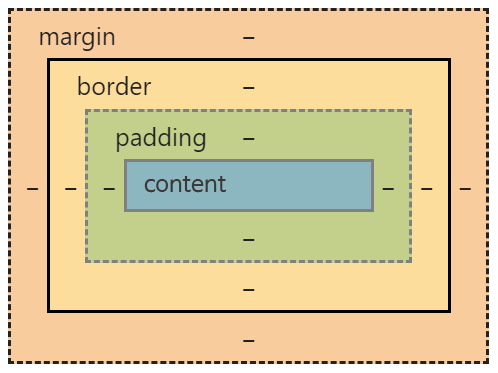

> 👑 20.11 ~ <br>
> 🧩 유투브 Webstoryboy [https://www.youtube.com/channel/UCsvQSv7EeCMHyYb9ENKAJZw](https://www.youtube.com/channel/UCsvQSv7EeCMHyYb9ENKAJZw)

# 🍕 피자모음 (필요 이론 모음집)
 
 <br><br>
🍕🍕 웹 접근성과 웹 표준<br>
[웹 접근성 연구소](https://www.wah.or.kr:444/) / [네이버 웹표준 '널리'](https://nuli.navercorp.com/) / [다음 웹표준 '다룸' (서비스종료)](http://darum.daum.net/)<br>
웹 표준 : 장애인 차별 금지 법에 따라서 만들어짐<br>
웹 접근성 : 모든 사람들이 정보통신 기기나 서비스를 손쉽게 활용할 수 있게 하는 것<br>
따라서 사이트를 코딩할 때 웹 접근성과 표준을 맞춰서 만들어야 함<br>
<br><br>

🍕 웹폰트<br>
구글폰트 사용
[https://fonts.google.com/](https://fonts.google.com/)<br>
<br><br>

🍕🍕🍕 이미지를 표현하는 방법<br>
① img 태그로 표현 (의미가 있을 때) / alt 태그 - 대체 문자 표현<br>
② background 속성으로 표현 (의미가 없을 때) - 대체 문자 X - 웹 표준 준수X<br>
③ background 속성으로 표현하면서 대체 문자를 사용 : **IR효과 + 이미지 스프라이트 효과**<br>
<br>
🍕 IR효과 : 이미지 대체텍스트 제공을 위한 CSS 기법. 가상으로 대체롤 문자를 만들어줌<br>
IR효과의 기법 3가지 : Phark Method / WA IR / Screen Out <br>
```css
/* Phark Method : 의미있는 이미지의 대체 텍스트를 제공하는 경우 */
.ir_pm {display: block; overflow: hidden; font-size: 0; line-height: 0; text-indent: -9999px;}
/* WA IR : 의미있는 이미지의 대체 텍스트로 이미지가 없어도 대체 텍스트를 보여주고자 할 때 */
.ir_wa {display: block; overflow: hidden; position: relative; z-index: -1; width: 100%; height: 100%;} 
/* Screen Out : 대체 텍스트가 아닌 접근성을 위한 숨김 텍스트를 제공할 때 */
.ir_so {overflow: hidden; position: absolute; width: 0; height: 0; line-height: 0; text-indent: -9999px;}
```
<br>
🍕 이미지 스프라이트 : 하나의 png 파일에 로고나 아이콘 같은 이미지들을 생성. 그 하나의 png 파일만 사용하며 position을 줘서 각각 불러옴 <br>

```css
.img_sprite {
	width: 60px; 
	height: 60px; /* 가로세로 60px 사이즈 공간 안에(=이미지크기) */
	background: url(../img/icon.png) no-repeat -60px -60px;
	/* 좌상단(top,left)으로부터 60px 떨어진 부분의 이미지를 넣음 */
	/* 즉, icon.png의 가로세로 60px~120px 부분을 보여주게 됨 */
}
```
이미지 스프라이트 좌표 찾기에 유용한 사이트 : [spritecow](http://www.spritecow.com/) <br>
<br><br>

🍕 font-awesome 아이콘 사용 방법<br>
① (일반적) 제공하는 i태그 복사해서 html 파일에 붙여넣기<br>
② (css로 컨트롤하기) 페이지 검사로 들어가 ::before에 입력된 번호 확인<br>
css파일에 들어가서 가상선택자 before 만들어주고 content에 번호 입력하기<br>
```css
.slick-prev { 
	font: normal normal normal 14px/1 FontAwesome;
}
.slick-prev::before {
	content: "\f105";
	color: #ffffff;
}
```
<br><br>

🍕🍕🍕 반응형 사이트의 3가지 원칙<br>
① 유동 레이아웃(flexible layout)<br>
② 미디어쿼리 (media query)<br>
③ 반응형 이미지(responsive image)<br>
<br><br>

## HTML

🍕 html5shiv<br>
구 익스에서 시멘틱 태그를 인식시켜주는 라이브러리<br>
(시멘틱 태그: HTML5에서 태그가 의미론적으로 파생되어 생긴 태그)<br>
새로 생긴 태그들이 구 익스에서는 인식하지 못하기 때문에 HTML5shiv를 사용하게 됨<br>
```html
<!-- HTLM5shiv ie6~8 -->
    <!--[if lt IE 9]> 
      <script src="js/html5shiv.min.js"></script>
      <script type="text/javascript">
         alert("현재 브라우저는 지원하지 않습니다. 크롬 브라우저를 추천합니다.!");
      </script>
   <![endif]-->
```
<br><br>

🍕 아웃라이너<br>
[https://gsnedders.html5.org/outliner/](https://gsnedders.html5.org/outliner/)<br>
html로 기본 레이아웃 잡을 때 참고하는 사이트<br>
<br><br>

🍕 강조태그 `<em>` / `<strong>`<br>
물리적 태그 : 특별한 의미없이 모양만을 결정하는 태그<br>
논리적 태그 : 태그 자체가 의미를 가져서 출력 형태보다 의미가 중요한 태그<br>
`<b>` : 물리적 태그. 단순히 구별을 위해 굵은 글씨로 표시<br>
`<i>` : 물리적 태그. 단순히 구별을 위해 글자를 이탤릭체로 표시<br>
`<em>` : 논리적 태그. 강조하고 싶은 텍스트에 사용. 주로 이탤릭체로 표시<br>
`<strong>` : 논리적 태그. 중요성을 강조하고 싶은 텍스트에 사용. `<em>`보다 의미가 더 강함. 주로 굵은 글씨로 표시<br>
=> 중요한 의미나 강하게 강조할 때 `<strong>`, 그냥 글씨를 강조하고 싶을 때 `<em>`<br> 
<br><br>

🍕 이미지 태그 `` / `<figure>` / `<picture>`<br>
`` : 이미지를 불러 올 때 사용``<br>
`<figure>` : 이미지를 표현 할 때 사용<br>
```html
<figure>
	
	<figcation>이미지 설명</figcaption>
</figure>
```
 `<picture>` : 이미지를 화면 크기에 따라 사용. 미디어쿼리를 이용한 표현 가능 (반응형)<br>
```html
<picture>
	<source media="(max-width: 799px)" srcset="img799w.jpg">
	<source media="(min-width: 800px)" srcset="img8009w.jpg">
	
</picture>
```
=> `` 태그의 `srcset` 속성을 이용하면 화면크기 및 해상도에 따라 이미지 표현이 가능함<br>
```html

```
<br><br>


## CSS

🍕 `@charset "utf-8"`<br>
페이지 소스 볼 때 한글이 깨지지 않도록 css 파일에서 가장 상단에 적어줌<br>
<br><br>

🍕🍕🍕 box-model<br>
<br>
웹 페이지에서 요소를 구성하는 가장 기본적인 것은 영역. 각 태그의 영역은 box-model로 구성됨<br>
- content : 글씨가 삽입되는 영역<br>
- border : 테두리 영역<br>
- padding : content와 border 사이 안쪽 여백<br>
- margin : border와 다른 캐그 영역 사이 바깥 여백<br>
<br><br>

🍕 box-sizing<br>
모든 요소는 margin, border, padding 값을 가지고 있음. 즉, width값과 height값을 가지고 있음<br>
그래서 요소의 가로 값과 세로 값은 **width(height) = margin + padding + border** 이며 이것은 default값인 `box-sizing: content-box;`와 동일함<br>
ex) width: 50px; margin: 20px; padding: 10px; border: 1px; => 50 + 20x2 + 10x2 + 1x2 = 112px<br>
이 때, `box-sizing: border-box;` 라고 설정할 경우에는 padding값과 border값을 포함하지 않기 때문에  **width(height) = margin** 으로 적용됨<br>
ex) width: 50px; margin: 20px; padding: 10px; border: 1px; => 50 + 20x2 = 90px<br>
<br><br>

🍕 box-shadow<br>
참고링크 [https://webzz.tistory.com/420](https://webzz.tistory.com/420)<br>
CSS3 (IE9부터 지원) 속성 중 하나로 그림자를 안/밖 나눠 지정할 수 있기 때문에 색상 전환 등의 효과에도 사용함<br>
ex) h1에 마우스 올렸을 경우 색상 변경<br>
```css
h1 {transition: box-shadow 0.25s ease-in-out;} /* 스크롤처럼 덮히게(ease-in-out) */ 
h1:hover {
	box-shadow: inset -9em 0 0 0 #257fac, /* 안쪽(inset) -9em 지점부터(왼쪽부터) 색상 전환 */
	            inset 9em 0 0 0 #257fac;  /* 안쪽 9em 지점부터(오른쪽부터) 색상 전환 */
}
```
 <br>
<br><br>

🍕 `>`<br>
바로 밑에 있는 자식만 사용할 때 사용<br>
`.nav div {}` : nav 밑 div의 div등 모든 후손 div 선택<br>
`.nav > div {}` : nav 바로 밑에 있는 div만 선택<br>
<br><br>

🍕 `float: left;`로 인한 영역깨짐(height:0) 방지법<br>
한 줄에 자기만 있고 싶은 block구조를 오른쪽 정렬 시켜주기 위해서는 float을 사용하게 됨<br>
하지만 float을 사용할 경우 상위 박스의 height값이 0으로 설정, 즉 영역이 사라지게됨<br>
이를 해결하기 위해 height 값을 인식할 수 있도록 해줘야 함<br>
① 깨지는 영역에 똑같이 float; left를 사용<br>
--> 계속적으로 모든 박스에 float:left를 써줘야해서 비추<br>
② float의 성질을 차단하는 `clear: both;`를 사용<br>
--> 레이아웃이 복잡해지면 어떤 영역이 깨졌는지 찾기 어려워서 비추<br>
③ float을 사용한 상위 박스한테 **overflow: hidden;** 을 사용<br>
--> overflow의 원래 기능에서 벗어나지만 제일 많이 사용하는 방법 (가끔씩 추천). 단, 2단 메뉴부분이나 드롭다운 메뉴와 같이 하위 메뉴가 있는 경우에서는 사용하지 못함<br>
④ **clearfix** 사용<br>
--> 가상으로 영역을 만들어 height값을 인식하도록 함. 제일 best. 반응형에서 사용<br>
```css
/* clearfix */
.clearfix {*zoom:1;} /* IE7 아래도 지원 */
.clearfix:before, .clearfix:after {display: block; content: ''; line-height: 0;}
.clearfix:after {clear: both;} /* float의 성질 차단 */
```
⇒ `float: left;`를 사용했으면 부모한테 `overflow: hidden;`을 주는 습관을 가질 것<br>
==> 더 나아가서는 clearfix 이용에 길들여질 것<br> 	
<br><br>

🍕 텍스트 한 줄로 제한두기<br>
```css
ul li {
	overflow: hidden;
	text-overflow: ellipsis;
	white-space: nowrap;
}
```
한줄을 넘어가는 텍스트는 ... 처리 돼 생략<br>
<br><br>

🍕 브라우저에 따른 child 적용<br>
`div:last-child { }` :  ie9부터 사용 가능<br>
따로 클래스 명을 지정해서 `div.클래스명 { }` : ie8 아래도 사용 가능 (=모든 브라우저 적용)<br>
프로젝트를 진행하면서는 거의 둘 다 작성<br>
<br><br>

🍕 콘텐츠 요소를 보이지 않게 하는 방법<br>
① `display: none;` (<-> `display: block;`) (영역이 사라짐. 공백X)<br>
② `visibility: hidden;` (<-> `visibility: visible;`) (영역은 유지함. 공백O)<br>
③ `opacity: 0;` (<-> `opacity: 1;`) (영역은 유지함. 공백O)<br>
④ `width: 0; height: 0; overflow: hidden;`<br>
<br><br>

🍕 `margin-right: -1px;`<br>
(tab 메뉴 등에서) 붙어있는 서로 다른 개체에 border값을 줬을 때 이어지는 박스처럼 보이는 것이 아닌 사이에 간격이 있는 것 처럼(한 줄이 아닌 두 줄 처럼) 보일 때 이를 수정하기 위해 사용<br>
<br><br>

🍕 햄버거 메뉴 (모바일 메뉴)<br>
html에서 구조를 잡은 뒤 css에서 가상선택자를 이용해 3개의 막대기와 손가락 터치 영역 크기를 지정<br>
햄버거 메뉴는 주로 반응형 웹페이지에서 모바일 크기로 줄어들었을 때 등장함. 따라서 display:none -> block으로 전환이 필요<br>
```html
<nav id="mNav">
	<h2 class="ir_so">메가박스 전체메뉴</h2>
	<a href="#" class="ham"><span></span></a>
</nav>
```
```css
/* 레이아웃 */
#mNav {display: none; position: absolute; top: 10px; right: 14px;}

/* 모바일 메뉴 */
.ham {display: block; width: 25px; height: 10px; background: rgba(0,0,0,0.4); padding: 15px 10px 10px 10px;} /* 손가락 터치하는 영역 크기 지정 (=햄버거 주위로 조금 더 크게) */
.ham span {position: relative; display: block; width: 25px; height: 4px; background: #39106a;} /* 가운데 막대기 */
.ham span:before {
    content: '';
    width: 25px; height: 4px; background: #39106a;
    position: absolute; left: 0; bottom: -7px;
} /* 아래 막대기 */
.ham span:after {
    content: '';
    width: 25px; height: 4px; background: #39106a;
    position: absolute; left: 0; top: -7px;
} /* 윗 막대기 */

/* 미디어 쿼리 */
@media (max-width: 1024px) {
    #mNav {display: block;}
}
```
 <br>
<br><br>

🍕🍕🍕 Media Query<br>
반응형 웹 페이지를 제작하기 위해서 사용하는 viewport 와 media query<br>
viewport : PC 화면 비율을 모바일 비율로 바꿔줌<br>
media query : 화면 크기에 따라 CSS를 제작함<br>
media query 적용 방법<br>
① 외부 링크 사용 `<link rel="stylesheet" href="style.css"/>` (주로 사용) <br>
② 화면 크기별로 CSS 작성 `<link rel="stylesheet" media="all and (min-width:280px)" href="style.css"/>` <br>
③ import 시키기 `@import url(style.css) all and (min-width: 380px);`<br>
<br>
```css
/* @media [only/not] [media type] [and/.] (조건문) {실행문} */

/* min을 사용한다면 */
@media (min-width: 380px){실행문}
@media (min-width: 768px){실행문}
@media (min-width: 960px){실행문}
@media (min-width: 1280px){실행문}
/* max를 사용한다면 */
@media (max-width: 1280px){실행문}
@media (max-width: 960px){실행문}
@media (max-width: 768px){실행문}
@media (max-width: 380px){실행문}
```
<br><br>

🍕 Media Query - img<br>
미디어쿼리를 이미지 해상도 조절을 위해 사용할 수도 있음<br>
디바이스 해상도에 따라서 각기 다른 이미지를 링크로 걸어 조절하기 위해서 reset.css로 따로 빼서 작업하기도 함<br>
```css
/* 이미지 최적화 작업 */
.img {background-image: url(img.png);}

@media only screen and (-webkit-min-device-pixel-ratio: 1.5),
       only screen and (min-device-pixel-ratio: 1.5),
       only screen and (min-resolution: 1.5dppx){
            .icon {background-image: url(img@2.png); background-size: 500px;}
       }
```
<br><br>

🍕 반응형 div 활용 1 <br>
```html
<div class="box">
	<div class="box_left"></div>
	<div class="box_right"></div>
</div>
```
 <br>
좌우로 두개의 div를 갖고 있을 때 반응형 작동 시 오른쪽 div는 길이를 유지하고 왼쪽 div는 길이가 변화하도록 하는 방법<br>
```css
.box {position: relative;}
.box .box_left { /* 가변 */
	margin-right: 423px; /* 오른쪽 div를 넣을 만큼 margin 지정해서 비움 */ /* width 지정 별도로 하지 않음 */
	height: 500px;
	background: #ccc url(../img/new01.jpg) center top; background-size: cover;
	/* 줄어들 때 이미지도 가운데를 유지하도록 background-position을 centop top으로 지정 */
}
.box .box_right { /* 고정 */
	position: absolute; right: 0; top: 0px; /* absolute 이용해서 처음부터 고정 위치(pixel) 조정 */
	width: 400px; height: 500px; /* width를 pixel로 지정 */
	background: #f0f0f0;
}
```
<br><br>

## jQuery

🍕 jQuery Setting <br>
jQuery: JavaScript를 사용하기 어려움을 겪는 사람들을 위해 조작 단순화를 제공하는 라이브러리. JS를 이용해서 자주 사용하는 코드를 쉽게 만들어 놓은 스크립트 언어<br>
특징 : CSS를 쉽게 적용 / 크로스브라우징 지원 / 플러그인 풍부 / 코드를 적게, 효울적 작성 / 좋은 확장성 / ajax기능 구현<br> 
[jQuery.com](https://jquery.com/) > [Google CDN](https://developers.google.com/speed/libraries#jquery) 에서 스크립트 가져와 연동<br>
```html
<script src="https://ajax.googleapis.com/ajax/libs/jquery/1.12.4/jquery.min.js"></script>
```
또는 파일 다운 받고
```html
<script src="js/jquery.min_1.12.4.js"></script>
```
<br><br>

🍕 jQuery 와 CSS <br>
```js
$("#cont_nav").css("display","block");
// #cont_nav {display: block;}
```
id, class 명을 표현하는 방법과 같이 공통되는 부분이 있기 때문에 적절히 활용<br>
<br><br>


## JS

🍕 modernizr-custom.js<br>
[modernizr-custom.js](https://modernizr.com/)
브라우저 기능검사 도구. 사용자 브라우저의 HTML5, CSS3 기능들을 감지하고 지원여부를 판별하는 JS 라이브러리<br>
```html
<!-- Modernizr 연동 -->
<script src="js/modernizer-custom.js"></script>
```
```javascript
/* Modernizr 감지 */
if(Modernizr.canvas){
	// canvas를 지원할 경우
} else {
	// canvas를 지원하지 않을 경우
}
```
<br><br>

🍕 ie-checkr.js<br>
```html
<script src="js/ie-checker.js"></script>
```
익스 6,7,8,9,10 체크해줌<br>
<br><br>

🍕 Slick.js <br>
[Slick.js](https://kenwheeler.github.io/slick/) / [Slick.js Github](https://github.com/kenwheeler/slick/)<br>
슬라이드 표현을 위해 자주 사용하는 플러그인 Slick.js<br>
공식 홈페이지랑 깃헙에 적힌 공식 문서를 위주로 활용 방법 익히기<br>
<br><br>

🍕 swiper.js <br>
[swiper.js](https://swiperjs.com/) / [swiper.js Github](https://github.com/nolimits4web/swiper)<br>
슬라이드 표현을 위해 자주 사용하는 플러그인 swiper.js<br>
공식 홈페이지랑 깃헙에 적힌 공식 문서를 위주로 활용 방법 익히기<br>
<br><br>

🍕 lightGallery.js <br>
[lightGallery.js](https://sachinchoolur.github.io/lightGallery/) / [lightGallery.js Github](https://github.com/sachinchoolur/lightGallery)<br>
이미지 갤러리를 따로 표현해주는 플러그인 lightGallery.js<br>
공식 홈페이지랑 깃헙에 적힌 공식 문서를 위주로 활용 방법 보고 넘어가기<br>
<br><br>

🍕 `e.preventDefault();` <br>
이전 상태를 기억하는 명령어<br>
```js
$(".btn").click(function(e){
	e.preventDefault();
});
```
click 이벤트를 실행했을 때 스크롤이 맨 위로 올라가게 되는 현상을 막는데에도 사용<br>
<br><br>


